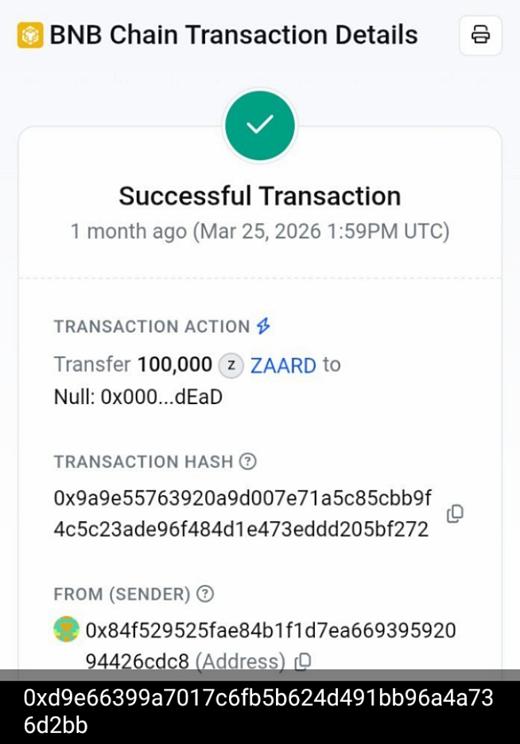
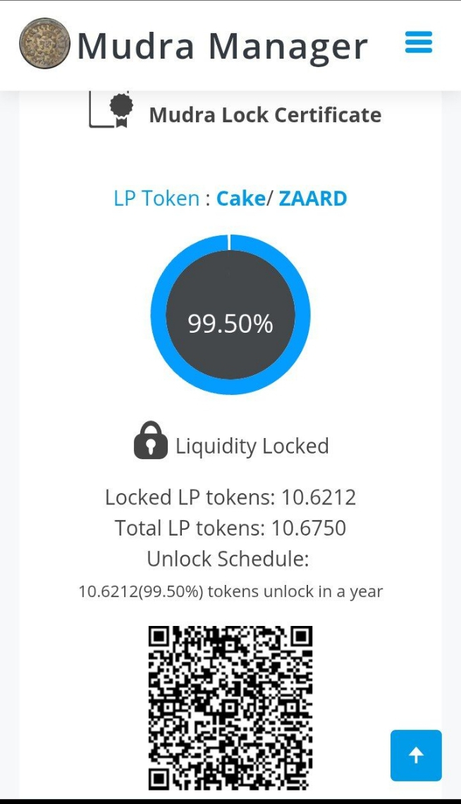

# ZAARD-Audit
Official Transparency &amp; Security Audit for ZAARD INNOVATION protocol. Documentation of burns, liquidity locks, and smart contract verifications.
# 🦅 ZAARD INNOVATION - Protocol Transparency & Audit

Este repositorio contiene la documentación técnica, pruebas de seguridad y estados de auditoría del ecosistema **ZAARD**. Bajo la visión de **Panga**, mantenemos un compromiso total con la transparencia on-chain.

## 📊 Estado de la Auditoría (Token Sniffer)

| Análisis | Resultado | Detalle Técnico |
| :--- | :---: | :--- |
| **Honeypot Test** | ✅ SAFE | El token es vendible (Buy/Sell fee 0%). |
| **Source Code** | ✅ VERIFIED | Contrato público y verificado en BSCScan. |
| **Ownership** | ✅ SECURE | Propiedad renunciada o sin funciones maliciosas. |
| **Liquidity Lock** | 🔒 99.50% | Bloqueada mediante Mudra Manager. |

> **Análisis del Score (50/100):** El puntaje actual refleja un proyecto en etapa temprana. Los puntos pendientes corresponden a la liquidez inicial y a la reserva de tokens en la wallet del creador, los cuales están destinados exclusivamente al sistema de recompensas de **ZAARD ARCADE**.

---

## 🔒 Pruebas de Seguridad On-Chain

### 1. Quema de Suministro (Burn)
Se ha ejecutado una quema del **10% del total supply** (100,000 ZAARD) para asegurar un modelo deflacionario.
* **Hash de Transacción:** [`0x9a9e55763920a9d007e71a5c85cbb9f4c5c23ade96f484d1e473eddd205bf272`](https://bscscan.com/tx/0x9a9e55763920a9d007e71a5c85cbb9f4c5c23ade96f484d1e473eddd205bf272)

### 2. Bloqueo de Liquidez (LP Lock)
El **99.50%** de los tokens del pool de liquidez (Cake-LP) están bloqueados por un periodo de **1 año**.
* **Certificado oficial:** [Mudra Lock Certificate](https://mudra.website/?certificate=yes&type=0&lp=0x38666399a7017c6fb5b624d491bb96a4a736d2bb)

## 🔒 Pruebas de Seguridad On-Chain

## 🛡️ Auditoría de Seguridad (GoPlus)

Para garantizar la transparencia de **ZAARD INNOVATION**, a continuación se detalla el análisis de seguridad del contrato inteligente:

  
  
  

> [!TIP]
> Puedes verificar estos resultados en tiempo real visitando [GoPlus Security](https://gopluslabs.io/).

### 1. Quema de Suministro (Burn)
Se ha ejecutado una quema del **10% del total supply** (100,000 ZAARD) para asegurar un modelo deflacionario.

* **Hash de Transacción:** [`0x9a9e55763920a9d007e71a5c85cbb9f4c5c23ade96f484d1e473eddd205bf272`](https://bscscan.com/tx/0x9a9e55763920a9d007e71a5c85cbb9f4c5c23ade96f484d1e473eddd205bf272)

### 2. Bloqueo de Liquidez (LP Lock)
El **99.50%** de los tokens del pool de liquidez (Cake-LP) están bloqueados por un periodo de **1 año**.

* **Certificado oficial:** [Mudra Lock Certificate](https://mudra.website/?certificate=yes&type=0&lp=0x38666399a7017c6fb5b624d491bb96a4a736d2bb)

---

## 🚀 Ecosistema ZAARD
* **Blockchain:** Binance Smart Chain (BSC)
* **Contrato:** `0xd9e66399a7017c6fb5b624d491bb96a4a736d2bb`
* **Desarrollador:** Panga / ZAARD INNOVATION
* **Audit Link:** [Token Sniffer Live Report](https://tokensniffer.com/token/bsc/0xd9e66399a7017c6fb5b624d491bb96a4a736d2bb)

---

* **🏠 Official Website:** [https://figueredo56.github.io/zaard-official/](https://figueredo56.github.io/zaard-official/)
* **🐦 Official X (Twitter):** [@ZAARD_666](https://x.com/ZAARD_666)
* **💰 Binance User Profile (Founder/DAO):** [View on Binance](https://account.binance.com/register?ref=776427353&?registerChannel=user_center) (User ref: 776427353)
## 👤 Founder & Lead Developer
Desarrollado por **Aracelis (Panga)** - Founder de ZAARD INNOVATION.

---
*Desplegado con éxito para la comunidad de ZAARD INNOVATION.*
